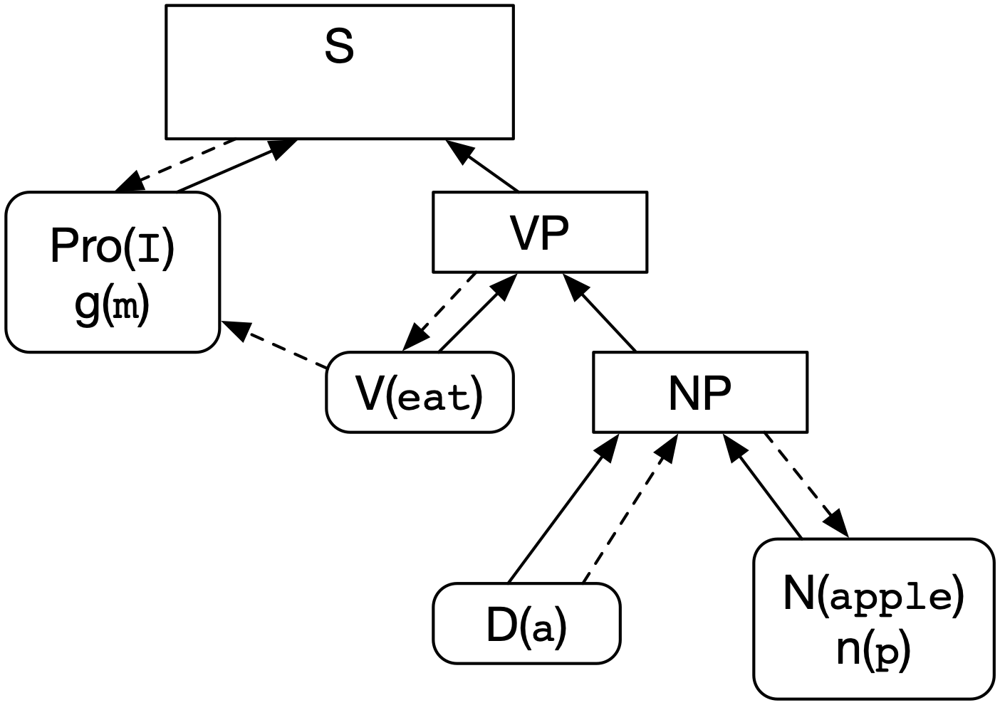
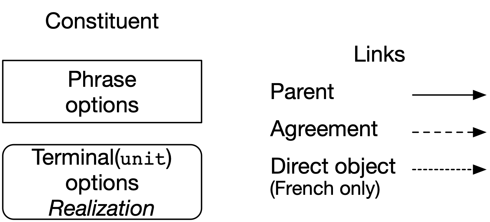
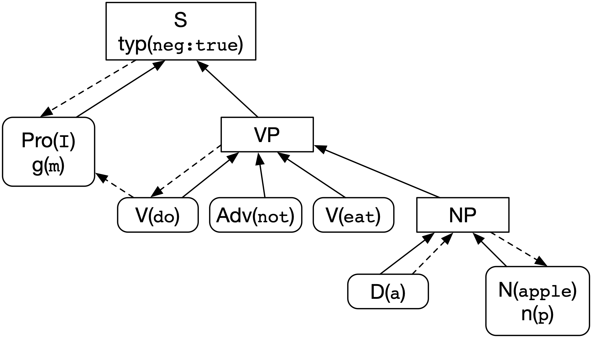
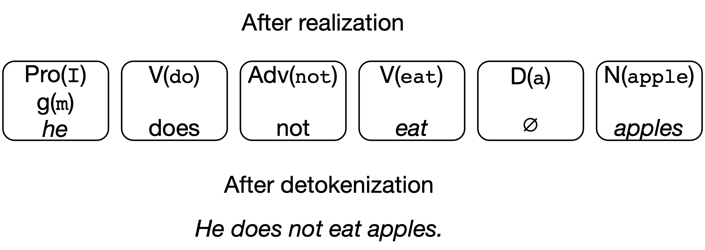
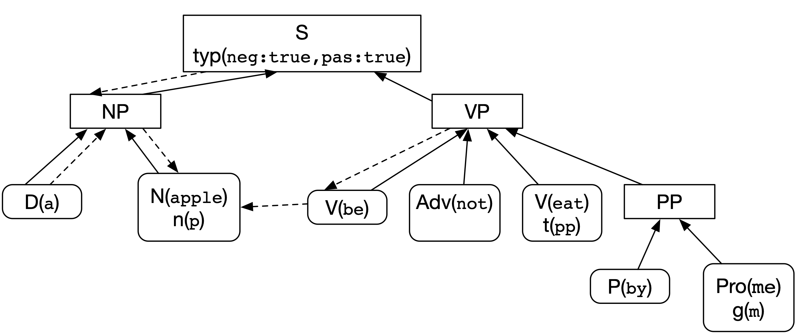
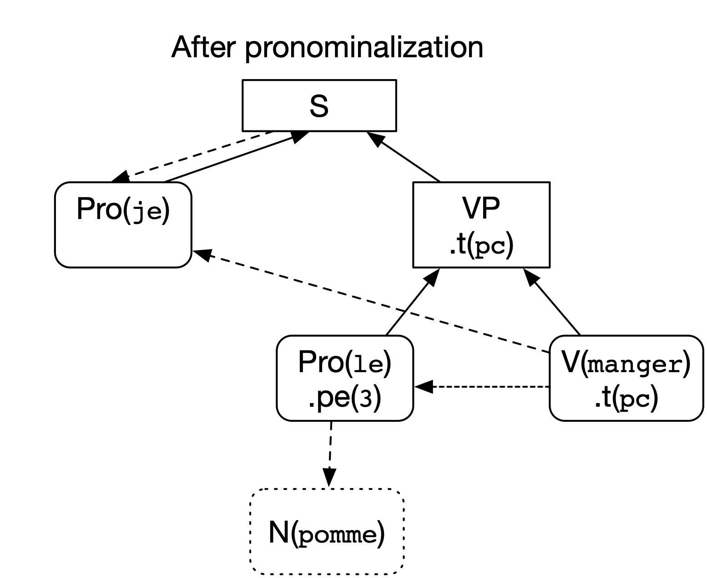
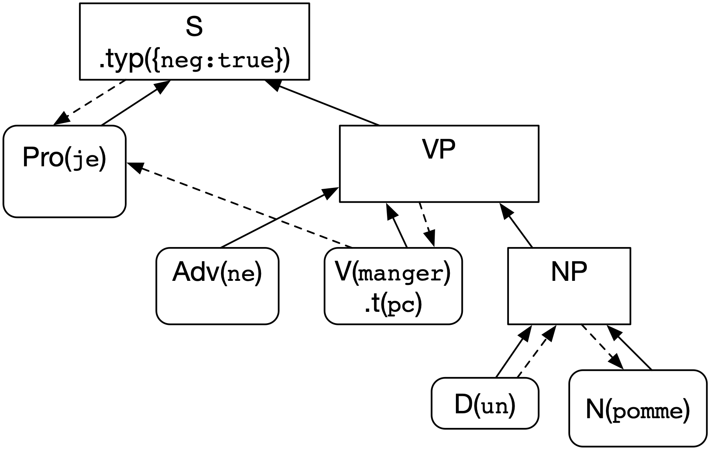
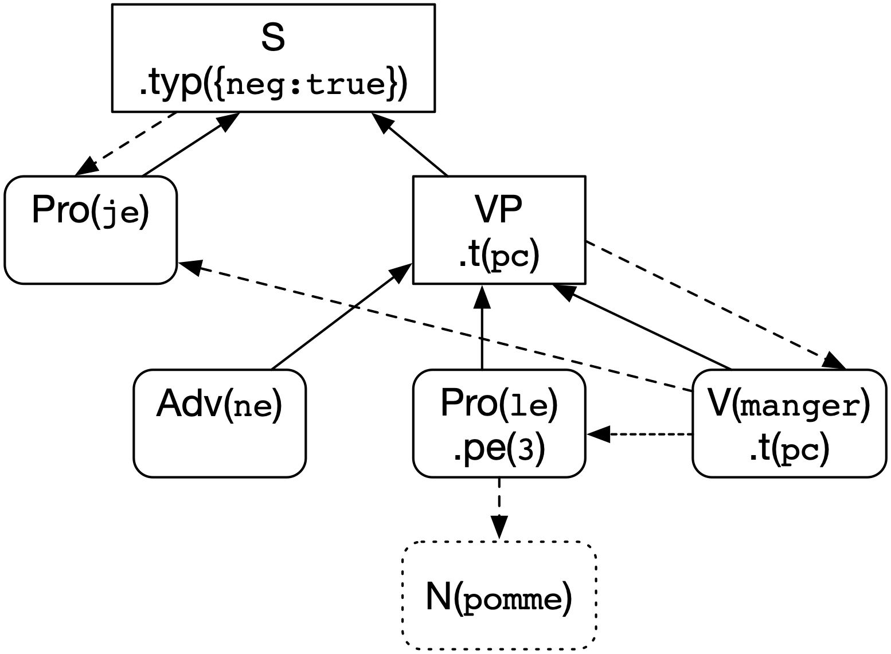
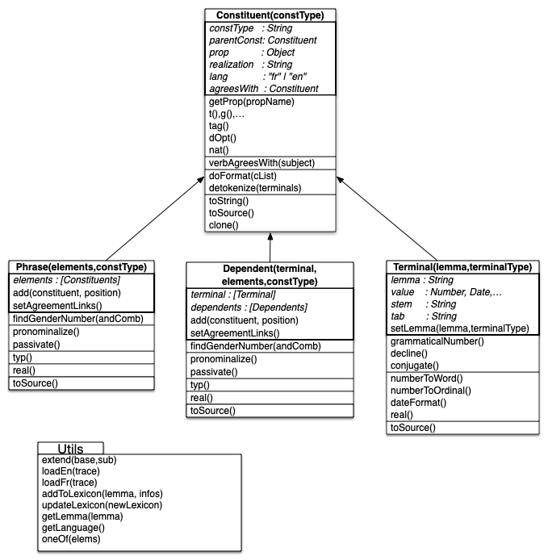

# Architecture of a Text Realizer

```
Guy Lapalme
RALI-DIRO, Université de Montréal
November 2019
```

This document describes the design principles behind [jsRealB](http://rali.iro.umontreal.ca/rali/?q=en/jsrealb-bilingual-text-realiser), a system written in *Javascript* that can produce English or French sentences from a specification inspired by the *constituent syntax* formalism. It can be used either within a web page or as a `node.js` module.

The text realizer is at the very end of a text generation pipeline. Important decisions about *What to say* have already been made. Sentence structure and most content word choices must also have been decided. 

But there is still interesting work to do: the realizer must take care of many language peculiarities such as conjugation, word order, elision, number and person agreements. These might seem to be small *details*, but users appreciate them and find it very annoying or disturbing when they are not properly dealt with. Our realizer allows creating many variations (e.g. negative, passive or interrogative) from a single affirmative sentence structure.

`jsRealB` has been developed by my students since 2013. The source code is now available on [GitHub](https://github.com/rali-udem/jsRealB) with a tutorial and demo applications. I recently decided to build on that experience and redesign the system from the ground up. I kept the same external interface using the existing tests and demos to develop the new version. Only the inner workings have been changed and simplified given my experience with the system over the last few years.

This document takes for granted that the user has some knowledge of constituent syntax and Javascript. The reading of the first sections of the [jsRealB tutorial](http://rali.iro.umontreal.ca/JSrealB/current/Tutorial/tutorial.html "jsRealB tutorial") might also be helpful.

We first start with a small example to illustrate some of the challenges in building a text realizer that most people take for granted, but in which many details must be taken into account. We will then present the structure of the application.

## Steps in the realization process

### Structure creation

To illustrate the steps to go from a `jsRealB` expression to the corresponding English sentence, we start with the structure for a very simple sentence: `He eats apples.`

    S(Pro("I").g("m"),
      VP(V("eat"),
         NP(D("a"),N("apple").n("p")))
     )

`jsRealB` expressions are standard Javascript expressions built by functions such as (`S`, `VP`,`Pro`, etc.), possibly modified with methods (i.e. object functions using the dot notation), so no special parsing of the input to `jsRealB` is necessary. The system takes for granted that the internal representation is a valid Javascript data structure built by the functions. Conventionally in Javascript, identifiers starting with a capital letter are constructors not functions. But in Linguistics,  symbols for constituents start with a capital letter so we kept this convention. Moreover in the previous version of `jsRealB`, constituents were created using constructors, so this allows source code compatibility between the two versions.

This expression corresponds to the following sentence structure:

* a sentence (`S`) composed of:
    * a personal pronoun `Pro` as subject; its argument `"I"` is used as lemma for all personal pronouns that can be modified in gender here masculine `g("m")`; the number `n("s")` and the person `pe(3)` are not specified because they are the default;
    * a verb phrase `VP` composed of:
      * a verb `V("eat")`
      * a noun phrase `NP` composed of:
          * an indefinite determiner `D("a")`
          * a plural noun `N("apple").n("p")`

which corresponds to the following tree structure:

<!---->
 

The diagrams in this document use the following set of drawing conventions:

<!---->
 

* Non-terminals (corresponding to a **Phrase**) are shown as a rectangle containing its name and possible options on the next line.

* A **Terminal** (to be realized as a string of words, possibly none) is displayed as a rounded rectangle containing its name followed by its *lemma* in parentheses; possible options appear on the second line and in the third line is shown the realization string once it has been determined; this string does not appear yet, it will be computed later.

* Full line arrows indicate child-parent relationships and dashed lines indicate agreement links between terminals (words). In the previous tree, the verb must agree in person and number with the subject (the pronoun) and the determiner must agree in number with the noun. In French, past participle can also agree in some cases with a direct object which is indicated by a dotted line.

One of the many implementation challenges of `jsRealB` is the building of appropriate data structures using the functions while maintaining the agreement links between nodes in the tree. This will be explained later in the document, but first we explain how to go from an input structure to an English sentence.

The previous example showed a single Javascript expression to build the internal structure. But a structure is most often incrementally and modified using Javascript instructions as shown below.  

When a realized sentence is needed, the usual Javascript `toString()` object method  is called to perform a *stringification* process which involves setting the `realization` property of the object, formatting this string and then detokenization for building a single final string.  We now detail these steps.

### *Stringification* of constituents

The production of strings from `Terminal`s and `Phrase`s is done recursively. Realization strings are produced for each `Terminal`, but also for each `Phrase` at each level of the tree. At each step, this process builds lists containing the original `Terminal`s which thus can access information from the original tree (e.g. number, gender or agreement links) for proper conjugation and declension.

#### Setting the realization property
The `toString()` function of a **Phrase** calls `toString()` on its children and builds a single list of terminals with their realization field filled in.

The `toString()` function of a **Terminal** applies declension or conjugation rules taking into account the gender, number, person and possibly tense information to create the `realization` field of the terminal. The following figure illustrates a few interesting cases. 
 
<!---->
 

* `Pro("I").g("m")` is realized as `he` because the gender is set to masculine, but the person and number take the default third person, singular;
* `VP("eat")` is realized with a string `eats` because the verb is conjugated to agree with the pronoun at third person, singular;
* `D("a")` produces an empty string because it is a plural indefinite article which must agree with a plural noun; the fact that it is plural is determined because the number is obtained by following the *agreement links*: `D` agrees with the `NP` which itself agrees with the `N` whose number is plural; 
* `N("apple").n("p")` produces `apples`, the plural declension of the lemma `apple`.

#### Formatting the `realization` property
Formatting is done in a series of optional steps. 

* Apply language dependent token modification rules taking into account the surrounding words:
    * English: 
        * *euphony* of determiner `a` changed to `an` depending on the first letter of the next word, most often a vowel;
    * French:
        * *elision* for determiners such as `le`, `ce`, `la`, etc. or conjunctions such as `que`, `puisque`: if the next word starts with a vowel, then the last letter is changed to an apostrophe `'` which will be merged with the next word;
        * *euphony* for adjectives such as `beau`, `fou` or `vieux` are changed to `bel`, `fol` or `vieil` if the next word starts with a vowel;
        * *contraction* combining words such as `de le` to `du`, `si il` to `s'il`, `à les` to `aux`.
* modify the realization string to insert strings that should appear before (`.b(..)`), after (`.a(...)`) or around (`.en(...)`) the realization string;
* surround the realization string with HTML tags given by (`.tag(...)`).

In the above example, no such modifications are needed, so the strings in the `Terminal` objects are left as is.  Later examples will make use of these steps.      

#### Detokenization
When the `toString()` called for a constituent at the *top-level* level of an expression, i.e. its parent constituent link is `null`, a *detokenization* process is applied to produce the well-formed English sentence `He eats apples.` 

This creates a single string by inserting appropriate spacing between the realization strings of the terminals. When this is called for top-level `S`, it capitalizes the first letter of the sentence and adds a full stop at the end, unless indicated otherwise.
 
## Structure modifications

One interesting feature of `jsRealB` is the fact that a single affirmative sentence structure can be rendered as negative, passive, interrogative or with a modality verb using the `.typ({...})` method which can be applied to a sentence or a verb phrase. The object given as parameter of `.typ(...)` is a group of flags that determine the type of modifications on the affirmative sentence.

We first illustrate the *simple* case of the negation.

### Negation

    S(Pro("I").g("m"),
      VP(V("eat"),
         NP(D("a"),N("apple").n("p")))
     ).typ({neg:true})

The following diagram shows the sentence structure once the `.typ({neg:true})` is added to the top-level `S` constructor. This will modify the structure of the `VP` by adding an auxiliary *do* and the adverb *not* in front of the verb. But now it is the auxiliary `do` that must agree with the subject.

<!---->
 

When this structure is realized it gives the following:

<!---->
 

### Passivization

We show here the *passive* transformation of our previous example `pas:true` is added in the object of the `.typ` call) to be realized as `Apples are not eaten by him.` 

    S(Pro("I").g("m"),
       VP(V("eat"),
          NP(D("a"),N("apple")).n("p"))
     ).typ({neg:true,pas:true})

In the *passivation* process, the object becomes the subject, the main verb becomes `be`, the original verb must be changed to past participle and the original subject becomes a prepositional phrase starting with `by`. In our example, the original subject being a nominative pronoun, it must be put to the accusative, that is why the lemma has changed from `"I"` to `"me"`. The agreement link between the original verb and the subject must be modified to link the verb `be` with the new subject; in this case the verb will be plural, but set to the negative mood because the whole sentence is negative.

<!---->
 

Calling `.toString()` on this modified structure produces the following tokens:

<!---->
 

### Pronominalization

Another interesting structure transformation is the pronominalization process that can be applied to a noun phrase. This time we take an example in French because it illustrates more interesting transformation processes coupled with agreement difficulties within the realization process. The original structure is a small variation on our previous example for the sentence `Il a mangé une pomme.` (literal English: `He has eaten the apple.`) in which the verb is conjugated to *passé composé*, roughly corresponding to the English present perfect. This corresponds to the following `jsRealB` expression:

    S(Pro("je"),
      VP(V("manger").t("pc"),
         NP(D("un"),N("pomme"))
     )

<!---->
 

which is serialized as the following instances of `Terminal`:

<!---->
 

Now, if we pronominalize the `NP` by writing:

    S(Pro("je"),
      VP(V("manger").t("pc"),
         NP(D("un"),N("pomme")).pro()
     )


The expected sentence is `Il l'a mangée.` (literal English: `*He it has eaten.`).

Pronominalization occurs when the object method `pro()` is called which modifies the structure as follows:

<!---->
 

The noun being used as direct object must be replaced by an accusative pronoun. In this case `Pro("le").pe(3)` agreeing in gender and number with the original noun that will not be realized; this is why it is shown as a dotted rounded rectangle in the picture.

In French, some *interesting* peculiarities must be taken into account:

* a pronoun used as direct object must appear **before** the verb (except for an imperative verb), so the order of the children of the `VP` must be changed while maintaining the agreement links; 
* A verb conjugated at the *passé composé* is built using an auxiliary verb (`avoir` in this case) followed by a past participle;
* a past participle must agree in gender and number with its direct object when it appears before it. This was not the case in the original sentence, but once the pronoun has been shifted before the verb, it must agree. An agreement link must thus be added between the verb and the pronoun which itself agrees with the original noun.

The modified structure is realized in the same way as in the preceding section to give the following tokens:

<!---->
 

which after the elision process to transform `la a` to `l'a` and the formatting gives: `Il l'a mangée.`

#### Further modifications

If we negate the previous expression as:

    S(Pro("je"),
      VP(V("manger").t("pc"),
         NP(D("un"),N("pomme")))
     ).typ({neg:true})

Negation in French negation is indicated by wrapping `ne ... pas` around the verb, so it implies adding the adverb *ne* before the verb.

<!---->
 

This is realized with the following tokens:

<!---->
 

When the `NP` in this sentence is pronominalized as:

    S(Pro("je"),
      VP(V("manger").t("pc"),
         NP(D("un"),N("pomme")).pro())
     ).typ({neg:true})

We now have the following structure in which the pronoun appears before the verb but after *ne*, the first part of the negation which gives the following structure:

<!---->
 

realized as the following tokens

<!---->
 

resulting in the sentence `Il ne l'a pas mangée.`

### Remarks on structure modification

So we see that it is possible to get many variations from a single input structure, we think that this feature is one of the most interesting and fruitful use for a text realizer.  We have seen that a single input specification can become quite different once the options have been applied. 

## Other interesting features to take into account

### Incremental building of *phrases*

Although our previous examples of `jsRealB` expressions have been created manually, these expressions are most often created by programs by calling the functions from within a Javascript program. Moreover it can happen that not all arguments to a phrase are determined before building the call to the function; for example, the subject and the verb can be determined in one part of the program and only later are the complements specified. To account for this possibility, `jsRealB` allows to add new elements to an existing phrase. This is done with the `add(Constituent,position)` method which adds either a `Phrase` or a `Terminal` to the current `Phrase` at a certain position (given by a non-negative index). If `position` is not specified, the element is added at the end of the current elements.

For example 

    S(Pro("I").g("m"),
          VP(V("eat"),
             NP(D("a"),N("apple").n("p")).add(A("red"))
             )
     ).add(Adv("now"),0)

is realized as `He eats red apples`. The adjective `red` is added at the end of the `NP` but because all adjectives in English are placed before the noun, it appears before the noun. The adverb `now` having position 0, is inserted at the start of the sentence.

### Coordination

Coordinated phrases are specified by a phrase `CP` in which a conjunction must be given with as many elements as needed. All elements except for the last are separated by a comma followed by the conjunction and the final element. For example:

    S(CP(C("and"),NP(D("the"),N("apple")),
                  NP(D("the"),N("orange")),
                  NP(D("the"),N("banana"))),
      VP(V("be"),A("good")))

is realized as `The apple, the orange and the banana are good.` in which `jsRealB` takes into account that the subject is now plural because of the `and`. If `C("or")` had been given, the verb would have been realized as singular.

Such coordinated sentences are often build incrementally and thus should only one element be needed. For example,

    S(CP(C("and"),NP(D("the"),N("apple"))),
      VP(V("be"),A("good"))) 

is realized as `The apple is good.` in which the conjunction is ignored and the number stays singular (unless the single subject is plural). 

The generation of the tokens for a coordinated phrase must be performed at the *last minute*, i.e. at realization time, for which this special case must be checked.

### Reusing `jsRealB` expressions

One of the advantages of using a programming language for creating text is the fact that repetitive structures can be coded once and reused as often as needed. `jsRealB` expressions, being Javascript values, can be saved in variables, received as parameters or returned as result from functions. This fact is heavily used in the demos and tutorial. 

As the options modify the original structure of the expression, it is worth pointing out that reusing a modified expression will use the modified expression and not the original one; this is the usual Javascript behavior for objects. So given the following definition:

    var apple = NP(D("a"),N("apple"))

the expression

    S(Pro("I").g("m"),
      CP(C("and"),
         VP(V("eat"),apple),
            VP(V("love"),apple.pro())))
      
is realized as `He eats an apple and loves it` which is expected.

But now, the following expression 

    S(apple,VP(V("be"),A("red")))
    
is realized as `It is red.` in which the pronominalization of `apple` is still in effect. 

If this is not what was intended, then a new `apple` object should be created before pronominalization. To achieve this, we can call `clone()`which creates a new copy of the `Constituent`. This is implemented by traversing the object and creating a `String` that corresponds to the `jsRealB` expression for building this object. The resulting string is then evaluated in the current context to build a copy of the original expression. So our previous `S` could have been coded as

    S(Pro("I").g("m"),
      CP(C("and"),
         VP(V("eat"),apple),
         VP(V("love"),apple.clone().pro())))

after which

    S(a,VP(V("be"),A("red")))

is realized as `The apple is red.`

### Formatting

`jsRealB` being aimed at web developers, it is important to deal with the generation of HTML tags using the method `tag(name,attributes)` where `attributes` is an optional object whose keys are attribute names and values the corresponding attribute values. When this method is encountered, it only saves the parameters and the values in the constituent. As described above, it is at *stringification* time that these values are used to create the final string while taking into account HTML tags. For example

    S(Pro("I").g("m"),
          VP(V("eat"),
             NP(D("a"),N("apple").tag("a",{href:'https://en.wikipedia.org/wiki/Apple'}))
         )) 

is realized as `He eats an <a href="https://en.wikipedia.org/wiki/Apple">apple.</a>` in which the elision is performed between `a` and `apple` even though the first letter of `apple` does not appear immediately after `a`. 

The punctuation before, after and around constituents is dealt similarly. The appropriate values of the strings to be inserted are saved within the constituent structure and used during the *stringification* process.  

**CAVEAT**: This implementation choice implies a *small* limitation: HTML and other formatting cannot appear anywhere within the text, they must match constituent boundaries.

### Conclusion

We have described some aspects of the `jsRealB` system that define an interesting middle ground between a very abstract input specification and a detailed formatting language. It allows automating the *finishing touch* for well-formed language that can be published or sent to a user.   This section has merely described the challenges that have been dealt with. The next section give more details on the internals of the system.

## Organization of the system

This section is quite *technical* and has been designed as a high-level documentation for a user wishing to modify the system. It is more easily understood in parallel with the source code. 

### Class structure

Although Javascript is not a class-based object system, the structure of `jsRealB` can be understood as a small hierarchy of three classes shown below in which shared methods for both `Phrase` et `Terminal` objects are defined in `Constituent`. The user does not (in fact, cannot) call the following constructors. The user instead calls functions such as these ones, for a `Phrase` or a `Terminal` that return the value created by the constructor.

    function NP  (_){ return new Phrase(Array.from(arguments),"NP"); }
    function N  (lemma){ return new Terminal("N",lemma) }
    
In the figure, each *class* title shows its parameters, the first cell shows in italics the associated properties with their type followed by methods used when creating the object; next are shown the methods for each class.

<!---->
 

All functions validate their input, in the case of errors, they generate a warning message on the console. Realization is not stopped, the resulting string is the original lemma enclosed in double square brackets. 

We now describe the methods in each box. Only the main methods are shown and described here, auxiliary or simple utility methods are ignored here as are methods in other files: `Date.js`, `Elision.js` and `Number.js`):

#### `Constituent`
The constructor initializes the object properties `constType` with the parameter, `prop` to an empty object, `realization` to `null` and `lang` to the current realization language.

* `getProp(propName)` : find the current value of the property by first looking if the object has a value for this property; if it is not the case, follow the `agreeWith` links and look for the given property in the final object. If the value is not found, look for a default value which is language dependent: `{g:"n",n:"s",pe:3,t:"p"}` for English and `{g:"m",n:"s",pe:3,t:"p",aux:"av"}` for French. If the value is not found, return `undefined`.
* *option functions* : implement functions that set properties in the object. As these functions all follow the same following pattern, they are created by a generic function that implements these steps:
  * check that the value is allowed for this option e.g. only 1,2 or 3 are allowed for `pe`;
  * check that the current object is allowed to have this option;
  * if the current object is a `CP`, propagate the option to the internal coordinated constituents;
  * follow possible `agreesWith` link to find the end object to which the option will be set;
  * set the property in the object.
* *special options* : some options that do not follow the previous pattern are dealt specially:
  * `tag(name,attrs)` : add `name:attrs` to the current prop list;
  * `dOpt` :  options for numbers or a date, do validation and save as object property;
  * `nat()` : indicates if a number or a date will be realized in letter or numeric format.
* `verbAgreesWith` : set an `agreesWith` link between the current object and the object indicated as subject.
* `doFormat()` : during realization, deals with elision, punctuation, capitalization and HTML tag wrapping.
* `deTokenize()` : add appropriate spacing between the realization of each token then applies the elision process; if the current object is a `S` at the top level, capitalize the first letter unless an option forbids it and add a full stop at the end.
* `toString()` : call `real()` and then `deTokenize()` defined in the current `Phrase` or `Constituent`.
* `toSource()` : produce a string that corresponds to the options of the current object, this is useful for error messages, for debugging and for cloning. 
* `clone()` : evaluate the string produced by toSource() which in effect creates a new `jsRealB` object.

#### `Phrase`
Note that given the applicative order of execution of Javascript, this constructor is only called once all its parameters have been created. 
The constructor first calls the `Constituent` prototype and then initializes its list of elements with the `elements` parameter: it copies all elements but the last and then calls `add(element[last])`.

* `add(constituent, position)` : it adds the `constituent` to the list of elements to the given position (last if undefined); it then calls `setAgreementLinks()`; it checks for some special cases:
  * if an element is an adjective, it is placed before the noun in English, but in French some adjectives must be put before the noun, but most are put after; if the adjective has been marked as either pre or post-posed, then it is placed accordingly;
  * if an element is a noun that is marked as being pronominalized, then call `pronominalize()`.
* `setAgreementLinks()` : go through all `elements` and adjust agreement links depending on the type of the current element:
    * `NP` : check the following:
        * make the current `NP` agree with the first `N` taking into account a possible `NO` which can change the number; make elements `D`, `Pro` or `A` agree with this element;
        * if there is an internal `SP` containing a `Pro`: 
            * if the pronoun is `who` (or `qui` in French) make the verb in the `SP` agree with this element because it is subject;
            * in French, check for pronoun `que` that might be a direct object occurring before the verb; this will be checked when conjugating because if it occurs as a past participle it must agree with this NP.
    * `AP` : agrees with the first internal `A`.
    * `VP` : agrees with the first internal `V`.
    * `S`,`SP` : agrees with the subject (i.e. first `NP`,`N`,`Pro` or `CP`) and check special cases
        * in French, an adjective following the verb `être` must agree with the subject;
        * if there is coordination of verbs, then all verbs must agree with the single subject.
* `findGenderNumber(andComb)` : when many `N` occur within an `NP` determine the combined 
    * gender: feminine if all `N` are feminine, masculine otherwise;
    * number: plural if there more than one and they are combined with `and`, singular otherwise.
* `pronominalize()` : **NB**: this applies to a `NP` but it must be called by the *parent* constituent that sets the `parentConst` link
    * find the role of the `NP` (subject, direct or indirect object) within the parent constituent to determine the proper pronoun to use;
    * create the pronoun, make it agree with the current NP and replace it in the sentence (possibly move it before the verb in French).
* `passivate()` : find the subject and the object and invert them in the sentence, change the verb to passive (i.e. insert the verb `be` and put the original verb to past participle); in French, make the past participle agree with the new subject.
* `typ(types)` : perform structure modification of a `S`, `SP` or `VP` in the following order, when hte appropriate flag is set:
    * *passive*: call passivate();
    * *progressive*, *modality*, *negation*, *perfect*:
        * in French:
            * *progressive*: change the verb to `être en train de` *verb*, where `être` is conjugated like the original verb which is then set to infinitive;
            * *modality* : add the appropriate modality verb in front of the verb which is set to infinitive;
            * *negation* : insert `ne` before the verb and set a conjugation flag that will used when conjugating the verb at realization time.
        * in English: these options are implemented with auxiliary and modality verbs using the "affix hopping" rules by building a list of auxiliaries and affixes; these lists are then processed to create a list of Terminals with the appropriate conjugation flags; this list then replaces the original verb;
    * *interrogation* :
        * start with the appropriate interrogative pronoun;
        * move the auxiliary in front of the verb;
        * in some cases, remove the subject, the direct or indirect object.
    * *exclamative*: terminate the sentence with an exclamation mark.
* `real()` : if the current object is a `CP`, generate terminals by realizing each element of the `CP` and inserting a comma between the first elements and the conjunction before the last; for other types of phrases, realize each element and combine their list of Terminals into a single list; apply `doFormat()` on the resulting list. 
* `toSource()` : create a list of the result of `toSource()` to each element separated by commas and prefixed with the name of the phrase; the options are added by calling `toSource()` of the prototype constituent.

#### `Terminal`

* `setLemma(lemma,terminalType)` : initialize the object property `lemma` using the parameter and depending on the `terminalType` do one of these:
    * `DT` : initialize the date with the value of the lemma and set the default attributes for a date;
    * `NO`: initialize the date with the value of the lemma and set the default attributes for a number;
    * `N`, `A`, `Pro`, `D`: search the lexicon for the `lemma`; from this information set the object attributes `tab` and compute the `stem` to be used in the declension process; other information from the lexicon is saved in the objet `prop` attribute.
* `grammaticalNumber()` : computes the grammatical number for a `NO` in both French and English;
* `decline()` : using the `tab` number and `stem` property, find the string corresponding the gender and number of the object; comparative and superlative are dealt also according the the language;
* `conjugate()` : using the `tab` number and `stem` property, find the string corresponding the gender,  number and person of the object which should be a `V`; rules handling is specific for French and English;
* `numberToWord()` : realize a number a string of words;
* `numberToOrdinal()` : realize the string corresponding to an ordinal number;
* `dateFormat()` : realize a date according to the language specific options and rules ;
* `real()` : set the `realization` field for this terminal depending on its `constType:
    * `N`, `A`, `D`, `Adv`, `Pro`: result of `decline()`;
    * `V` : result of `conjugate()`;
    * `DT`: result of `dateFormat()`;
    * `NO`: result of `numberToWord()`, `numberToOrdinal()`, `numberFormatter()` or the current value, depending on the options;
    * `C`, `P`, `Q` : return the lemma;
      
  Finally call `doFormat()` (defined in `Constituent`) with a singleton string containing this `Terminal`;
* `toSource()` : return the lemma within quotes and parentheses preceded by the `constType`; call the `toSource()` of the prototype to add the options.

### Utilities

These functions (except for the first) can be called by the user to change global information for the realizer. They are described in the [documentation](../documentation/user.html#vocExtension).

* `extend(base,sub)` : create a *subclass* by manipulating prototype links (cannot be called by the user);
* `loadEn(trace)` : set the current lexicon and rule table for realizing sentences in English;
* `loadFr(trace)` : set the current lexicon and rule table for realizing sentences in French;
* `addToLexicon(lemma, infos)` : add a new lemma to the current lexicon by giving information for conjugation and lemmatization;
* `updateLexicon(newLexicon)` : replace the current lexicon by a new one;
* `getLemma(lemma)` : return the lexicon information for a given lemma;
* `getLanguage()` : return the current realization language;
* `oneOf(elems)` : selects randomly an element from a list.

## Conclusion

This document has described in some details the inner workings of a bilingual English-French text realizer. `jsRealB` has been used for creating demos and as an intermediary language for realizing sentences either from AMR structures or from Universal Dependencies in the context of the Surface Realization Shared Task (SR'19) at EMNLP.

We have shown that a seemingly simple task of producing well formed natural language text from a relatively abstract formalism involves a lot of intricate details that must the dealt with in order to create fluent and correct sentences.


