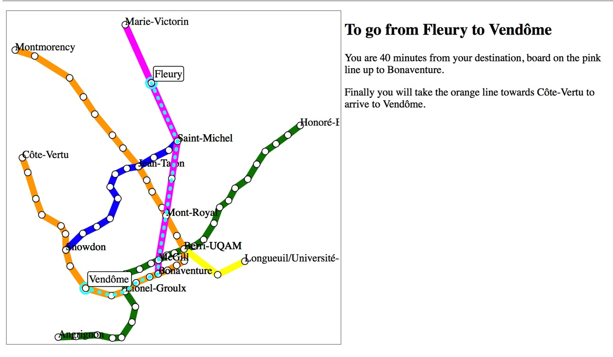

# jsRealB - A JavaScript Bilingual Text Realizer for Web Development

**Natural language generation** is a field of artificial intelligence that focuses on the development of systems that produce text for different applications, for example the textual description of massive datasets or the automation of routine text creation.

The web is constantly growing and its content, getting progressively more dynamic, is well-suited to automation by a realizer. However existing realizers are not designed with the web in mind and their operation requires much knowledge, complicating their use.

**jsRealB is a text realizer designed specifically for the web**, easy to learn and to use. This realizer allows its user to build a variety of French and English expressions and sentences, to add HTML tags to them and to easily integrate them into web pages.

**jsRealB can also be used in Javascript application** by means of a `node.js` module.

The documentation can be accessed [here](https://lapalme.github.io/documentation/user.html). You can switch language in the upper right corner of the page.

**Caution**

* Although `jsRealB` can be used in a web page using only one of the generated javascript files in the [`dist`](dist/) directory, [`node.js`](https://nodejs.org/en/) is necessary for the Javascript applications and for minifying the javascript using `uglifyjs`.
* The current build process relies on the availability of some unix tools such as `makefile`, `cat` and output redirection (`>`).
* Windows users (and others) will therefore want to use the pre-built files in the [`dist`](dist/) directory.

## Directories
* [`build`](build/): build system to create the JavaScript library. More details in the [`README`](build/README.md) in this directory.
* [`dist`](dist/): pre-built JavaScript files ready for production use.
* [`documentation`](documentation/): in both English and French. The examples are generated on the fly by embedding jsRealB in the page. [*Consult the documentation*](https://lapalme.github.io/documentation/user.html)
    * `user.html`: HTML of the core of the page (`div[id]` correspond to variables in `user-infos.js`)
    * `style.css`: style sheet
    * `user-infos.js`: definitions of variables containing the examples
    * `user.js`  : JavaScript helper script.
* [`IDE`](IDE/) : An Integrated Development Environment that embeds jsRealB to easily get the realization of an expression and to consult the lexicon, the conjugation and declination tables. [*Try the IDE*](https://lapalme.github.io/IDE/index.html).
* [jsRealB **Tutorial**](Tutorial/). [*Read the tutorial*](https://lapalme.github.io/Tutorial/tutorial.html)

## Demos
### Simple examples on a single sentence
* Show the use of loops in Javascript to create repetitive texts
    * English: [99 bottles of beer](demos/99BottlesOfBeer). [*Execute*](https://lapalme.github.io/demos/99BottlesOfBeer/index.html)
    * French: [1 km à pied](demos/KilometresAPied). [Execute](https://lapalme.github.io/demos/KilometresAPied/index.html)
* Tests of specific features
    * French and English sentences modified with time, number and conjugation: [Date generation](demos/date) [*Execute*](https://lapalme.github.io/demos/date/index.html)
    * Type a French or English sentence that will be realized with all possible sentence modifyers [Sentence variants](demos/VariantesDePhrases) [*Execute*](https://lapalme.github.io/demos/VariantesDePhrases/index.html)
    * French or English conjugation and declension of a word [Conjugation and declension](demos/inflection) [*Execute*](https://lapalme.github.io/demos/inflection/index.html)
    * Show elision in contrived French and English sentences even across HTML tags that are displayed on purpose [elision](demos/elision) [sentences to elide](build/elisionTests.js) [*Execute*](https://lapalme.github.io/demos/elision/index.html)
* `Node.js` module
    * a command-line interface written `node.js` program that, given a word, finds a jsRealB expression to realize it (this capability is now included in the IDE) [*lemmatize.js*](demos/lemmatize/lemmatize.js)
* User interface to create a simple sentence with options. The system shows the jsRealB expression and its realization. It is also possible to ask for a random sentence using words of the lexicon.
    * [RandomGeneration](demos/randomGeneration/) 
      [*Execute in English*](https://lapalme.github.io/demos/randomGeneration/english.html) 
      [*Execute in French*](https://lapalme.github.io/demos/randomGeneration/french.html)

### Text realization
* Create an [Exercise in Style](https://en.wikipedia.org/wiki/Exercises_in_Style) which creates the structure of the original story of Raymond Queneau in both French and English. Using menus, some elements of the text can be modified and the modifications are highlighted in the web page. [Exercises in style](demos/ExercicesDeStyle) [*Execute*](https://lapalme.github.io/demos/ExercicesDeStyle/index.html)

###  Data to Text applications
* **Description (in French) of a list of events** and associated informations given as a json file [Événements](demos/Evenements) [Execute](https://lapalme.github.io/demos/Evenements/index.html)
* **Description of list of steps for the building of a house**, given information about tasks, the duration and the precedence relations between them. 

    
    
  The system first computes the critical path to find the start and end times of each task. It then creates a graphic for displaying the PERT diagram and an accompanying text to explain the steps to follow. It is possible to interactively change the start date and to explore the graphic with the mouse which also uses jsRealB to generate the text of the tooltips. 
    * [English](demos/Data2Text/building.html) [*Execute*](https://lapalme.github.io/demos/Data2Text/building.html)
    * [French](demos/Data2Text/batiment.html) [*Execute*](https://lapalme.github.io/demos/Data2Text/batiment.html)
* **Itinerary description in an *optimistic* Montréal Métro network**. The system shows an interactive map of the Montréal Métro station with a new line. When a user clicks two stations, the systems realizes a text describing the itinerary to go from the first station to the second. 

    
    
    The langage of the web page and of the realization can be changed interactively by clicking in the top right of the page. [Metro](Tutorial/metro.html) [*Execute*](https://lapalme.github.io/Tutorial/metro.html)

## Authors
jsRealB was updated, developed and brought to its current version by [Guy Lapalme](http://www.iro.umontreal.ca/~lapalme) building on the work of:

1. [Francis Gauthier](http://www-etud.iro.umontreal.ca/~gauthif) as part of his summer internship at RALI in 2016; 
2. [Paul Molins](http://paul-molins.fr/) as part of an internship from INSA Lyon spent at RALI, University of Montreal in 2015;
3. [Nicolas Daoust](mailto:n@daou.st) developed the original concept in the JSreal realizer for French only in 2013.

For more information, contact [Guy Lapalme](http://rali.iro.umontreal.ca/lapalme).      
